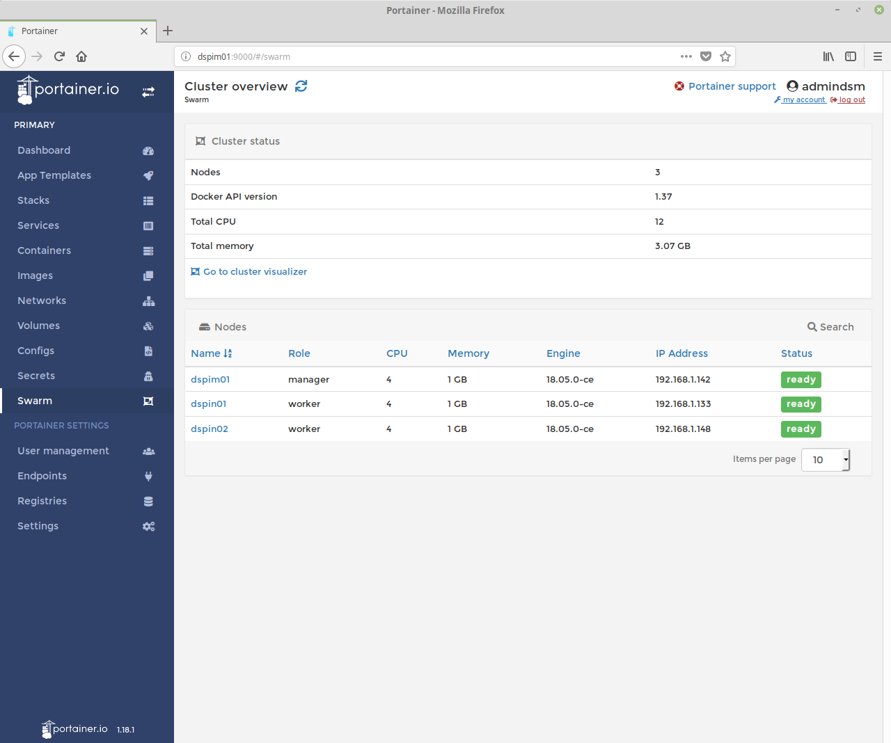

[toc]

# Introduction
Doing some work with Docker and containers increased my interesting in this technology. So I planned to built up a [Docker Swarm](https://docs.docker.com/engine/swarm/) cluster with 3 Raspberry Pi 3.

# Setup
## Hardware
My project has the following hardware setup:
- 3x Raspberry Pi 3
- 1x Raspberry Pi Stack Case
- 1x 6 Port USB PowerPort Loader, for example [Anker PowerPort 6](https://www.anker.com/store/powerport-6-ports/A2123123)
- 3x Cat 5e or better LAN cables
- 1x Network switch or router
- 3x Micro SD cards

## Software
There are two (perhaps more) options to install and run Docker on a Raspberry Pi:
1. Using [Raspbian (Lite)](https://www.raspberrypi.org/downloads/raspbian/) and install [Docker CE](https://docs.docker.com/install/linux/docker-ce/debian/) manually or via script
2. Using [Hypriot OS](https://blog.hypriot.com/) - a ready to use Raspberry Pi OS with minimal setup but Docker support
3. A tool to write the OS image to the SD cards - my favourite is [Etcher](https://etcher.io/)

Because I wanted to minimize the effort for setup and configuration I decide to use Hypriot OS.

## Architecture
Because the same hardware is used one of the 3 Pi's will be the Docker Swarm master and the other ones becomes a node. For this we have the following scenario:


In the picture above the master knows the nodes and can interact with them. For the hostnames I used the following initial letters from: **D**ocker **S**warm **Pi** **M**aster/**N**ode.

# Hypriot OS
## Installation
Download and install [Hypriot OS](https://blog.hypriot.com/) directly from their website. Also download [Etcher](https://etcher.io/) or use any other image writing tool to copy the OS to the SD cards 3 times.


After that unmount the SD card and plug it into the Pi.

## Manager configuration
Boot up the master and determine the ip address. For this you can login with the default credentials _pirate_ and password _hypriot_.
After that you can open a SSH connection from your current working system or do the changes directly on the Pi.
I prefer to work with SSH because it is easier to copy and paste some commands inside the Terminal instead of re-typing it.
```sh
$ ssh pirate@192.168.X.Y
# ...accept SSH key...
# ...connection is established...
HypriotOS/armv7: pirate@black-pearl in ~
$
```
### Install latest update
Update the package repositories and upgrade all packages.
```sh
$ sudo apt update && sudo apt upgrade -y
```
### Run raspi-config
After that we want to run `raspi-config` and setup some basics.
1. Hostname via _Network Options_
2. Localisation options

Setup the hostname for the master node => _dspim01_


Change the localisation to your needs. Also fit the current time zone and so on.


Reboot your system to overtake the changes.
Now reconnect via SSH using the hostname:
```sh
$ ssh pirate@dspim01
# ...accept SSH key...
# ...connection is established...
HypriotOS/armv7: pirate@dspim01 in ~
$
```
## Docker
Because Docker comes preinstalled you can enter `docker --version` inside your terminal to determine the current version.
```sh
$ docker --version
Docker version 18.05.0-ce, build f150324
```
Try to enter `docker ps` without sudo should show you the empty container list. This means that we can use docker as user.

**Note:** If you want to install Docker on your ARM device like a Raspberry Pi 3 and you don't use Hypriot OS read [this article from Alessandro Segala](https://withblue.ink/2017/12/31/yes-you-can-run-docker-on-raspbian.html) to get all the information you need.
### Install Docker Compose
Now we ready to install [Docker Compose](https://docs.docker.com/compose/install/) and the necessary command completion. Following the link above to do this manually or use [my script](https://github.com/andz-dev/dev-tools/tree/master/docker/install/arm).
```sh
$ wget -O install_compose_extensions.sh https://github.com/andz-dev/dev-tools/blob/master/docker/install/arm/install_compose_extensions.sh?raw=true; chmod +x install_compose_extensions.sh; sudo sh install_compose_extensions.sh
```
### Initialize the swarm
Run the following command to initialize a Docker Swarm.
```sh
$ docker swarm init
```
After initialization you've get the message that your current system is now a manager. For later usage we can join more nodes using `docker swarm join ...`.
### Init swarm and running portainer
With [Portainer](https://portainer.io/) we get a powerful management tool to manage our local docker instance and a Docker Swarm.
First of all we need to create a new volume there portainer can store it's data.
```sh
$ docker volume create portainer_data
```

After that we create a new docker service and set the instance as the manager swarm role. Docker will do the rest for us.
```sh
$ docker service create \
--name portainer \
--publish 9000:9000 \
--replicas=1 \
--constraint 'node.role == manager' \
--mount type=bind,src=//var/run/docker.sock,dst=/var/run/docker.sock \
--mount type=volume,src=portainer_data,dst=/data \
portainer/portainer \
-H unix:///var/run/docker.sock
```

**Note:** You can change the published port _9000_ to any other port.

The portainer container is downloaded from [Dockerhub](https://hub.docker.com/r/portainer/portainer/) and started. After that we can access the portainer UI with our webbrowser and port 9000.


Enter a new password to access the Web UI as admin. Click on _Create user_ to continue.
**Note:** For a higher security edit the admin account default name.
### Web UI
After login you see the _Dashboard_ and all necessary Docker information.


## Node configuration
The manager is running and awaits new nodes. Now it is time to configure our nodes and create the Swarm.
For this we need to repeat the configuration steps like we did for the manager:
1. Run `raspi-config`
    - Set hostname
    - Set localisation
2. Install Docker Compose
3. Join the Docker Swarm

First I configured the hostnames and then connected via SSH to finish the setup.
For each Raspberry Pi:
```sh
# Run raspi-config
$ raspi-config
# Reboot Pi
# Connect from host to Pi via SSH
$ ssh pirate@dspin01
# Install Docker Compose
$ wget -O install_compose_extensions.sh https://github.com/andz-dev/dev-tools/blob/master/docker/install/arm/install_compose_extensions.sh?raw=true; chmod +x install_compose_extensions.sh; sudo sh install_compose_extensions.sh
```
### Join Swarm
After setup we can join the swarm. For this need to know the managers token that was shown by the `docker swarm init` command.
If we didn't have it we can run `docker warm join-token worker` on the manager to show the token.
```sh
docker swarm join --token {TOKEN} {IP/HOSTNAME}:2377
```
For _dspin01_ and _dspin02_
```sh
$ docker swarm join --token SWMTKN-1-6163youtkgd4pttp5708pvqhifmqvv24nbvj07kd1selc9iyq6-5vyo2onoepsayabed9qpp8df8 dspim01:2377
```

After that switch to the Portainer UI and go to the _Swarm_ page. There are three devices listed.


## Host containers
Now we are ready to go to host some containers. For a frist try we use the _App Templates_. Navigate to this page and select the _Stack_ option. Then click on _Portainer Agent_, set a Name and click on _Deploy the stack_ to begin the deployment.


Wait some time till the _Stacks_ page is shown our _porttest_ Stack. Click on it in the list and you see that 1 container is running.
The portainer agent is scheduled globally - on all 3 devices in the swarm. With the agent Portainer can have more control to the Docker instances on the devices.
For more information [read the manual](http://portainer.readthedocs.io/en/stable/agent.html).


**If you want to deploy more containers and stacks read my other tutorials in this project page.**