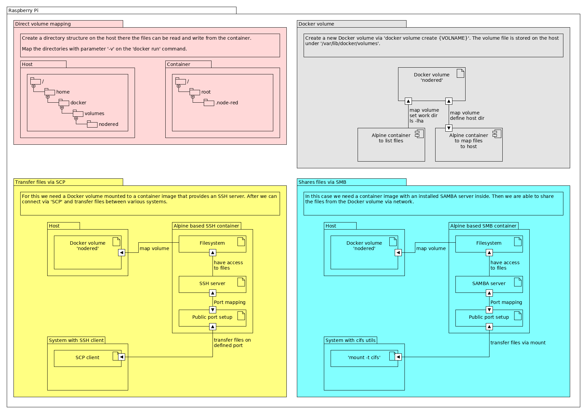

# Container data and volumes
[This tutorial based on my Node-RED container build project.](https://github.com/andz-dev/dev-tools/tree/master/docker/build)
If you mentioned from our container start the Node-RED user directory is placed in ```/root/.node-red```. To keep this data persistent after the container was deleted or re-run with other parameters - for example an other port than the default ones - there a two options:

1. Map the container directory to the host directory.
2. Create a Docker volume and map this volume to the container.

In both cases the data will be persistent as long as the Docker host is running and accessible. On any failure or data loss the data may be lost or damaged.

## Use direct mapping for data persistence
The easiest way to map our data is to create a new _share_ directory on the Docker host and map this to our container.

```sh
# Switch to home directory
$ cd ~
# Create a new directory structure, for example:
$ mkdir docker docker/volumes docker/volume/nodered
```

After that we set the ```-v``` (Volume) paramater on the ```run``` command and set both directories: ```-v {HOST_DIR}:{CONTAINER_DIR}```

```sh
$ docker run -it --rm --name test -p 1880:1880 -v $PWD/docker/volumes/nodered:/root/.node-red nodered-arm:0.1
```

During the container start we just see the console output. The mapping information won't shown. But if we cancel the container and have a look inside our host directory we see the files.

```sh
$ cd $PWD/docker/volumes/nodered
$ ls -lha
total 56K
drwxr-xr-x 4 pirate pirate 4,0K Jul 22 16:37 .
drwxr-xr-x 3 pirate pirate 4,0K Jul 22 16:36 ..
-rw-r--r-- 1 root   root    10K Jul 22 16:37 .config.json
-rw-r--r-- 1 root   root   9,9K Jul 22 16:37 .config.json.backup
drwxr-xr-x 3 root   root   4,0K Jul 22 16:37 lib
drwxr-xr-x 2 root   root   4,0K Jul 22 16:37 node_modules
-rw-r--r-- 1 root   root     99 Jul 22 16:37 package.json
-rw-r--r-- 1 root   root    11K Jul 22 16:37 settings.js
```

Changes made in the host directory will be loaded next time the container starts.

## Use Docker Volume
A Docker Volume is a file with a filesystem which can be used in a container for persistence data storage.
It's the preferred mechanism because Docker they are completely managed by Docker (bind mounts are dependent on the directory structure of the host).
You can list all available volumes in docker via: ```$ docker volume ls```
To create a new volume use the ```create``` command:

```sh
$ docker volume create nodered
```

The volume can now be used for our run command.

```sh
$ docker run -it --rm --name test -p 1880:1880 -v nodered:/root/.node-red nodered-arm:0.1
```

After stopping the container the data is stored inside the volume. If we work with a volume we have some benefits:

1. Our run command can be used on various systems there the host directory path doesn't exist.
2. A volume works great with swarm technology.
3. Volumes can be defined in Docker Compose files.

### List data from the volume
Other than direct host path maps the volume's data can't be read with just a command. But there are several ways to find out what is stored inside a Docker volume.
You can run ```$ docker volume inspect {VOLUME}``` to get the mounpoint information.

```sh
$ docker volume inspect nodered
[
    {
        "CreatedAt": "2018-07-22T17:58:38+02:00",
        "Driver": "local",
        "Labels": {},
        "Mountpoint": "/var/lib/docker/volumes/nodered/_data",
        "Name": "nodered",
        "Options": {},
        "Scope": "local"
    }
]
```

The ```inspect``` paramter shows you some details about the mount point and creation date.
To list the file content you can run a small container like _Alpine_ and execute the command ```ls -lha``` to the ```/tmp``` directory.

```sh
$ docker run -it --rm --name list_files -v nodered:/tmp/ -w /tmp/ alpine:3.8 ls -lha
total 56
drwxr-xr-x    4 root     root        4.0K Jul 22 15:58 .
drwxr-xr-x    1 root     root        4.0K Jul 22 16:16 ..
-rw-r--r--    1 root     root        9.9K Jul 22 15:58 .config.json
-rw-r--r--    1 root     root        9.8K Jul 22 15:58 .config.json.backup
drwxr-xr-x    3 root     root        4.0K Jul 22 15:58 lib
drwxr-xr-x    2 root     root        4.0K Jul 22 15:58 node_modules
-rw-r--r--    1 root     root          99 Jul 22 15:58 package.json
-rw-r--r--    1 root     root       10.7K Jul 22 15:58 settings.js
```

This means that we can mount the volume content via a new container to a host directory to list files and directory or edit some content.

If we want to get some files from the container there are various options to do that:

- map the container volume to the host

    ```sh
    $ docker run -it --rm --name list_files -v nodered:/tmp/ -v /tmp/containerdata:/tmp/ alpine:3.8
    ```

- forwarding data into a database (container)
    => depends on the use case and what data you want to store. Needs data extraction and filtering before storing into DBMS.
- run SSH and copy the files by SCP
- host a file server for data access

Because the first and second option needs a new tutorial ;) we will have a look to the SSH and mapping option.

## Run SSH and copy files via SCP
For this we need a container which provides an SSH server installed.
On x64 system we can use a container that is already available on [Docker Hub](https://hub.docker.com/r/hermsi/alpine-sshd/) from User _hermsi_. The base container image is Alpine and the SSH server is installed. Visit the Docker Hub project page for more information.
Run the container and map the Docker volume. After that connect via SSH to the container and copy the files with SCP to your host.

```sh
$ docker run --rm -p 1337:22 hermsi/alpine-sshd
```

But the image won't run on a Raspberry Pi because it doesn't support ARM and always the error message [_standard_init_linux.go:190: exec user process caused "exec format error"_](https://github.com/tiangolo/uwsgi-nginx-flask-docker/issues/67) is shown.

We have to build our own ARM compatible image.
Create a new Dockerfile on your Pi and insert the following content.

```Dockerfile
FROM alpine:3.8

# Based upon https://hub.docker.com/r/hermsi/alpine-sshd/~/dockerfile/
LABEL Maintainer "Andreas Elser"
LABEL Version "0.1"

ENV ROOT_PASSWORD root

RUN apk add --no-cache openssh \
        && sed -i s/#PermitRootLogin.*/PermitRootLogin\ yes/ /etc/ssh/sshd_config \
        && echo "root:${ROOT_PASSWORD}" | chpasswd \
        && rm -rf /var/cache/apk/* /tmp/*

ADD ./entrypoint.sh /usr/local/bin/
RUN chmod +x /usr/local/bin/entrypoint.sh

EXPOSE 22

ENTRYPOINT [ "entrypoint.sh" ]
```

We also need a script called _entrypoint.sh_ in the same directory like the _Dockerfile_. The script generates new host keys for the container.
Build the image with ```$ docker build -t ssh-arm:0.1```.
Run the container via ```$ docker run -d --rm --name sshtest -p 1337:22 -v nodered:/tmp/ ssh-arm:0.1```

**Note:** You can check if the container runs via ```$ docker ps``` and the port mapping with ```$ docker port sshtest```.
We are now able to access the container via _SHH_ on port _1337_.

```sh
$ ssh root@{RASPI-IP | RASPI-HOST} -p 1337
```

After login the Alpine Linux welcomes you.
Go to the directory _/tmp/_ and list your files.

```sh
4d63dcd83c8d:# cd /tmp
4d63dcd83c8d:/tmp# ls -lha
total 56
drwxr-xr-x    4 root     root        4.0K Jul 22 15:58 .
drwxr-xr-x    1 root     root        4.0K Jul 26 14:23 ..
-rw-r--r--    1 root     root        9.9K Jul 22 15:58 .config.json
-rw-r--r--    1 root     root        9.8K Jul 22 15:58 .config.json.backup
drwxr-xr-x    3 root     root        4.0K Jul 22 15:58 lib
drwxr-xr-x    2 root     root        4.0K Jul 22 15:58 node_modules
-rw-r--r--    1 root     root          99 Jul 22 15:58 package.json
-rw-r--r--    1 root     root       10.7K Jul 22 15:58 settings.js
```

We see that the files are the same like some steps before. Disconnect from SSH and we use SCP now to transfer the files.
**Note:** Set your port number to SCP ```-p``` and the parameter to copy the directory recursively ```-r```.

```sh
$ scp -P 1337 -r root@dspim01:/tmp/ /tmp/scp-example/
root@dspim01's password: 
.config.json                100%   10KB   1.4MB/s   00:00
settings.js                 100%   11KB   2.3MB/s   00:00
.config.json.backup         100%   10KB   1.6MB/s   00:00
package.json                100%   99    33.9KB/s   00:00

$ cd /tmp/scp-example/

$ ls -lha
total 56K
drwxr-xr-x  4 andreas andreas 4,0K Jul 27 06:41 .
drwxrwxrwt 18 root    root    4,0K Jul 27 06:41 ..
-rw-r--r--  1 andreas andreas  10K Jul 27 06:41 .config.json
-rw-r--r--  1 andreas andreas 9,9K Jul 27 06:41 .config.json.backup
drwxr-xr-x  3 andreas andreas 4,0K Jul 27 06:41 lib
drwxr-xr-x  2 andreas andreas 4,0K Jul 27 06:41 node_modules
-rw-r--r--  1 andreas andreas   99 Jul 27 06:41 package.json
-rw-r--r--  1 andreas andreas  11K Jul 27 06:41 settings.js
```

## Host a file server for data access
After we know how to copy files and directories from our volume via mounting and SCP we can also provide a file server to provide volumes data.
A possible way is to provide a _SAMBA_ file share server. I found an interesting container from _dperson_ on [Docker Hub](https://hub.docker.com/r/dperson/samba/). He provide an ready to use container image with samba.
After trying to start on my Pi the container won't work. So I decided to rebuild the container directly on the Pi for the best support.

```Dockerfile
FROM alpine:3.8

# Install samba
RUN apk --no-cache --no-progress upgrade && \
    apk --no-cache --no-progress add bash samba shadow tini && \
    adduser -D -G users -H -S -g 'Samba User' -h /tmp smbuser && \
    file="/etc/samba/smb.conf" && \
    sed -i 's|^;* *\(log file = \).*|   \1/dev/stdout|' $file && \
    sed -i 's|^;* *\(load printers = \).*|   \1no|' $file && \
    sed -i 's|^;* *\(printcap name = \).*|   \1/dev/null|' $file && \
    sed -i 's|^;* *\(printing = \).*|   \1bsd|' $file && \
    sed -i 's|^;* *\(unix password sync = \).*|   \1no|' $file && \
    sed -i 's|^;* *\(preserve case = \).*|   \1yes|' $file && \
    sed -i 's|^;* *\(short preserve case = \).*|   \1yes|' $file && \
    sed -i 's|^;* *\(default case = \).*|   \1lower|' $file && \
    sed -i '/Share Definitions/,$d' $file && \
    echo '   pam password change = yes' >>$file && \
    echo '   map to guest = bad user' >>$file && \
    echo '   usershare allow guests = yes' >>$file && \
    echo '   create mask = 0664' >>$file && \
    echo '   force create mode = 0664' >>$file && \
    echo '   directory mask = 0775' >>$file && \
    echo '   force directory mode = 0775' >>$file && \
    echo '   force user = smbuser' >>$file && \
    echo '   force group = users' >>$file && \
    echo '   follow symlinks = yes' >>$file && \
    echo '   load printers = no' >>$file && \
    echo '   printing = bsd' >>$file && \
    echo '   printcap name = /dev/null' >>$file && \
    echo '   disable spoolss = yes' >>$file && \
    echo '   socket options = TCP_NODELAY' >>$file && \
    echo '   strict locking = no' >>$file && \
    echo '   vfs objects = recycle' >>$file && \
    echo '   recycle:keeptree = yes' >>$file && \
    echo '   recycle:versions = yes' >>$file && \
    echo '   min protocol = SMB2' >>$file && \
    echo '' >>$file && \
    rm -rf /tmp/*

ADD ./samba.sh /usr/bin/
RUN chmod +x /usr/bin/samba.sh

EXPOSE 137/udp 138/udp 139 445

HEALTHCHECK --interval=60s --timeout=15s \
CMD [ "smbclient -L '\\localhost\' -U 'guest%' -m SMB3" ]

VOLUME [ "/etc/samba" ]

ENTRYPOINT [ "/sbin/tini", "--", "/usr/bin/samba.sh" ]
```

We also need a ```samba.sh``` script file and add it during the build process. Because the original one from the source above doesn't work with Alpine 3.8 we use the optimized script from user [_jondye_](https://github.com/jondye/samba).

After that we can build our container with ```$ docker build -t smb-arm:0.1 .```.

Before we start the SMB container it is necessary to install the _cifs_ utils on our host Pi for mounting the share we will provide.

```sh
$ sudo apt update && sudo apt install cifs-utils
```

We also create a new directory for mounting in _/tmp_:

```sh
$ mkdir /tmp/share/
```

Now we are ready to go to run our samba container with some arguments.

```sh
$ docker run --name smbtest -p 137:137/udp -p 138:138/udp -p 139:139 -p 445:445 -p 445:445/udp --hostname smbtest -v nodered:/share/nodered -d smb-arm:0.1 -u "user;user" -s "nodered;/share;yes;no;no;user;none;user"
```

The following docker host parameters are used:
- UDP ports 137, 138 and 445 are opened
- TCP ports 139 and 445 are opened
- Hostname is set to _smbtest_
- The docker volume is set to _/share/nodered_ inside the container
- The container will run as daemon. If you want to restart it after failure or reboot you can add _--restart=always_

The following container parameters are used:
- Create a new user ```-u``` _user_ with the same named password
- Create a new share ```-s``` with the following conditions:
    - name: _nodered_
    - path: _/share/nodered_
    - browsable: _yes_
    - readonly: _no_
    - guest: _no_
    - users: _user_
    - admins: _none_
    - writelist: _user_

After starting the container we mount the directory from the SMB server to our Pi host:

```sh
$ sudo mount -t cifs -o username=user,password=user //localhost/nodered /tmp/share
```

Switch to the directory _/tmp/share/nodered_ and list the content ```ls -lha```. You should see the content of the docker volume.

```sh
$ cd /tmp/share/nodered
$ ls -lha
total 4,0M
drwxr-xr-x 2 root root    0 Jul 22 17:58 .
drwxr-xr-x 2 root root    0 Aug  1 06:31 ..
-rwxr-xr-x 1 root root  10K Jul 22 17:58 .config.json
-rwxr-xr-x 1 root root 9,9K Jul 22 17:58 .config.json.backup
drwxr-xr-x 2 root root    0 Jul 22 17:58 lib
drwxr-xr-x 2 root root    0 Jul 22 17:58 node_modules
-rwxr-xr-x 1 root root   99 Jul 22 17:58 package.json
-rwxr-xr-x 1 root root  11K Jul 22 17:58 settings.js
```

## Summary
Data created in container is just persistent as long as the container lives. If we want to keep data for a longer term we need to map the data directly to the host or create a new volume (which is also stored on the host).
Accessing the data is easier if we map the volumes directly but is not useful because of data security and swarm technology.
The volume is the best way to store data but needs a little bit more to do to read and write the files and directories.
For this we can use an SSH server and copy files via SCP from container to the host.
Or we create a new SMB server which allows us to share the data with our host and other machines.

